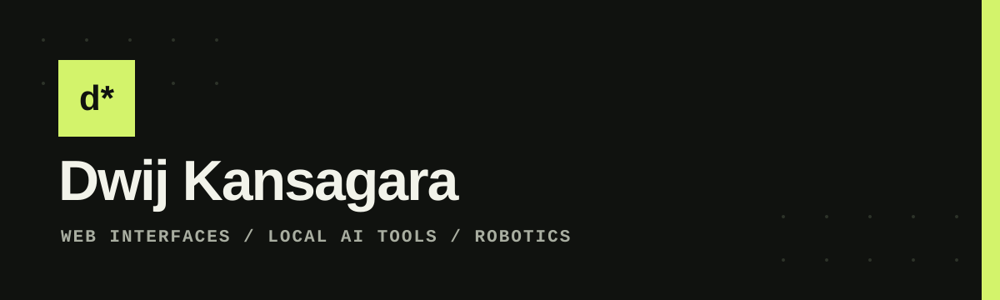

<div align="center">
  

  # About Dwij Kansagara

  A document-style introduction to my background, selected work, tools and current interests.

  **[Read the live document](https://about-me.antideploy.com)**
</div>

## What is included

- A responsive editorial layout with readable typography and measured motion.
- Direct links to Portfolio, LUMINA AI, JARVIS and Avengers: Doomsday.
- Clear personal details, technical interests and contact routes.
- A persistent anonymous visit counter and 20-step appreciation meter.
- Privacy, terms, cookie and refund pages written for the site's actual data practices.
- Keyboard-friendly navigation, semantic HTML, alt text and reduced-motion support.

## Run locally

This is a dependency-free static site. Open `index.html` directly or serve the directory with any static web server.

## Deploy

The production release is hosted on AntiDeploy. With an authenticated AntiDeploy account, run:

```powershell
python scripts/deploy_antideploy.py
```

The application ID is stored in `.antideploy.json`; account credentials stay outside the repository.

## Links

- [Live site](https://about-me.antideploy.com)
- [Portfolio](https://dwij-portfolio.antideploy.com)
- [GitHub profile](https://github.com/DwijKansagara)


